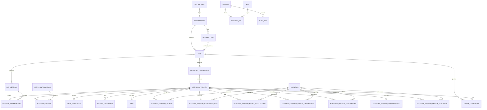

# Arquitectura consolidada y decisiones recomendadas

## 1. Objetivo de este documento

Este documento consolida la revision de los 4 artefactos entregados:

- requerimientos funcionales
- spec tecnica backend
- spec tecnica frontend
- contrato API

Su objetivo es cerrar las principales ambiguedades antes de iniciar implementacion y dejar una base lista para:

- ERD detallado
- `schema.prisma`
- backlog tecnico
- contrato API final

## 2. Diagnostico general

La iniciativa esta bien encaminada. La vision funcional es correcta y la arquitectura tecnologica propuesta es adecuada para el problema.

### 2.1 Lo que esta bien resuelto

- El dominio principal esta bien identificado.
- La actividad de tratamiento se entiende como unidad normativa.
- El RAT se entiende como contenedor.
- Se reconoce la necesidad de versionamiento y auditoria.
- El stack MVP es sensato: React + NestJS + PostgreSQL + Prisma.
- La decision de monolito modular es correcta.
- El frontend propone una UX guiada adecuada.

### 2.2 Lo que aun no esta suficientemente cerrado

- modelo relacional de actividad versionada
- multivalores del dominio
- roles y permisos definitivos
- workflow formal de transiciones
- estrategia de snapshots y reportes
- estrategia de observaciones y subsanaciones
- control de concurrencia
- frontera exacta entre auditoria y versionado

## 3. Decisiones de arquitectura recomendadas

## 3.1 Decision 1: monolito modular

Se confirma como decision correcta para MVP.

### Justificacion

- alta cohesion funcional
- muchas reglas transaccionales
- necesidad de consistencia fuerte
- menor costo operativo
- menor complejidad de despliegue

### Implicacion

No dividir en microservicios. Mantener modulos de dominio, pero con transacciones compartidas cuando el caso de uso lo requiera.

## 3.2 Decision 2: actividad de tratamiento como eje central del dominio

La entidad mas importante del sistema no es el RAT, sino la actividad de tratamiento y especialmente su version normativa.

### Implicacion

El modelo debe girar alrededor de:

- `rat`
- `actividad_tratamiento`
- `actividad_version`

Todo lo demas se conecta principalmente a `actividad_version`.

## 3.3 Decision 3: usar modelo relacional para multivalores del dominio

No recomiendo guardar en JSON los elementos funcionales principales.

### Deben ser tablas relacionales

- titulares
- categorias de datos
- medios de recoleccion
- acciones de tratamiento
- destinatarios
- transferencias
- medidas de seguridad
- asociaciones activo-actividad

### JSON solo para

- snapshots publicados
- auditoria before/after
- payloads tecnicos de apoyo

## 3.4 Decision 4: separar auditoria de versionado

Estas dos capacidades deben existir por separado.

### Auditoria responde

- quien hizo que
- cuando
- sobre que entidad
- con que valores antes y despues

### Versionado responde

- cual era el contenido oficial de una version
- cual fue la secuencia historica del objeto
- cual es la version vigente

### Implicacion

Se requieren al menos:

- `audit_log`
- `rat_version`
- `actividad_version`

Y adicionalmente snapshots de reporte cuando aplique.

## 3.5 Decision 5: reportes oficiales basados en version vigente o snapshot, no en datos editables libres

Para MVP se puede construir reporte web desde la version vigente consolidada.

Para evolucion posterior, recomiendo soportar snapshot publicado.

### Regla

- vistas operativas: pueden consultar datos vivos
- vistas oficiales/regulatorias: deben salir de version vigente o snapshot

## 3.6 Decision 6: roles y autorizacion por ambito

No basta con un solo campo `rol`.

### Recomendacion

Modelo de usuario con uno o varios roles, mas ambito organizacional:

- usuario
- rol
- usuario_rol
- dependencia asignada opcional
- subdireccion asignada opcional

### Roles recomendados MVP

- `ADMIN`
- `RESPONSABLE_DEPENDENCIA`
- `RESPONSABLE_SUBDIRECCION`
- `EDITOR_OPERATIVO`
- `REVISOR_PROTECCION_DATOS`
- `REVISOR_SEGURIDAD`
- `AUDITOR`

### Regla

Permisos = rol + accion + ambito.

## 3.7 Decision 7: estrategia de guardado del wizard

Para MVP recomiendo:

- guardado manual por paso
- persistencia inmediata al backend
- validacion por paso
- validacion final antes de enviar a revision

### No recomiendo inicialmente

- autosave complejo
- wizard completamente client-side sin persistencia intermedia

## 3.8 Decision 8: control de concurrencia minimo

Se debe implementar al menos una estrategia basica.

### Recomendacion MVP

- `updated_at` en todas las entidades editables
- validacion de ultima actualizacion al hacer `PATCH`
- validacion estricta de estado antes de transiciones

## 4. Modelo de dominio recomendado

## 4.1 Entidades maestras

- `tipo_proceso`
- `dependencia`
- `subdireccion`
- `usuario`
- `rol`
- `usuario_rol`
- `catalogo`

## 4.2 Entidades troncales

- `rat`
- `rat_version`
- `actividad_tratamiento`
- `actividad_version`
- `activo_informacion`
- `actividad_activo`
- `mtge_evaluacion`
- `riesgo_evaluacion`
- `eipd`
- `audit_log`

## 4.3 Entidades relacionales necesarias para actividad_version

- `actividad_version_titular`
- `actividad_version_categoria_dato`
- `actividad_version_medio_recoleccion`
- `actividad_version_accion_tratamiento`
- `actividad_version_destinatario`
- `actividad_version_transferencia`
- `actividad_version_medida_seguridad`

## 4.4 Entidades auxiliares recomendadas

- `revision_observacion`
- `alerta_contextual`
- `archivo_adjunto`

## 5. ERD conceptual inicial

## 6. Cardinalidades recomendadas

### RAT

- un `rat` pertenece a una `dependencia`
- un `rat` puede pertenecer opcionalmente a una `subdireccion`
- un `rat` tiene muchas `rat_version`
- un `rat` tiene muchas `actividad_tratamiento`

### Actividad

- una `actividad_tratamiento` pertenece a un solo `rat`
- una `actividad_tratamiento` tiene muchas `actividad_version`
- una sola `actividad_version` puede estar `VIGENTE`

### MTGE

- una `actividad_version` tiene cero o una `mtge_evaluacion` vigente
- puede haber historico si decides recalculos como nuevas filas

### Riesgo

- una `actividad_version` puede tener muchos `riesgo_evaluacion`

### EIPD

- una `actividad_version` puede tener cero o una `eipd` activa en MVP

### Activos

- una `actividad_version` puede tener muchos activos
- un `activo_informacion` puede participar en muchas actividades versionadas

## 7. Modelo de versionado recomendado

## 7.1 RAT

### `rat`

Entidad contenedora viva:

- codigo
- nombre
- descripcion
- dependencia
- subdireccion
- estado general

### `rat_version`

Contiene ciclo de version formal del RAT:

- numero version
- estado
- motivo
- fechas de aprobacion y vigencia
- creado por
- aprobado por

## 7.2 Actividad

### `actividad_tratamiento`

Entidad viva:

- rat_id
- codigo
- nombre
- descripcion
- estado general

### `actividad_version`

Entidad normativa y principal del sistema:

- numero version
- estado
- finalidad
- base licitud
- plazo conservacion
- flags normativos
- fecha proxima revision
- motivo actualizacion

Las colecciones funcionales de la actividad se relacionan con esta tabla.

## 8. Workflow recomendado

## 8.1 Estados de version

- `BORRADOR`
- `EN_REVISION`
- `OBSERVADA`
- `SUBSANADA`
- `APROBADA`
- `VIGENTE`
- `REEMPLAZADA`
- `ARCHIVADA`

## 8.2 Reglas de transicion

- `BORRADOR -> EN_REVISION`
- `EN_REVISION -> OBSERVADA`
- `OBSERVADA -> SUBSANADA`
- `SUBSANADA -> EN_REVISION`
- `EN_REVISION -> APROBADA`
- `APROBADA -> VIGENTE`
- `VIGENTE -> REEMPLAZADA`
- `VIGENTE -> ARCHIVADA`

## 8.3 Reglas operativas recomendadas

- una version `VIGENTE` no se edita
- toda modificacion a una `VIGENTE` genera nueva version
- al marcar nueva `VIGENTE`, la anterior pasa a `REEMPLAZADA`
- una observacion debe quedar almacenada con autor, fecha y comentario
- una subsanacion debe registrar comentario de respuesta

## 9. Reglas de negocio que deben congelarse

## 9.1 Cambio sustancial

Definir como cambio sustancial cualquiera que altere:

- finalidad
- base de licitud
- categorias de datos
- datos sensibles o biométricos
- titulares
- transferencias
- medidas de seguridad claves
- activos asociados
- resultado MTGE
- nivel de riesgo
- requisito de EIPD

### Regla

Un cambio sustancial en una version vigente obliga nueva version.

## 9.2 Regla EIPD

`requiere_eipd = true` si ocurre al menos una:

- `es_gran_escala = true`
- existe riesgo `ALTO` o `CRITICO`
- existen datos biometricos
- existen categorias especiales con alto impacto
- existe decision automatizada relevante

## 9.3 Regla activo con datos personales

Si `trata_datos_personales = true`, entonces:

- propietario obligatorio
- custodio obligatorio
- clasificacion obligatoria

## 9.4 Regla de envio a revision de actividad

No se puede enviar a revision si falta:

- finalidad
- base de licitud
- al menos una categoria de titular
- al menos una categoria de dato
- plazo de conservacion
- MTGE calculado

## 10. Observaciones y subsanaciones

## 10.1 Recomendacion

No tratar observacion como simple string suelto.

### Entidad sugerida: `revision_observacion`

Campos minimos:

- id
- entidad_tipo
- entidad_id
- version_estado_origen
- comentario
- autor_id
- fecha
- atendida
- comentario_subsanacion
- fecha_subsanacion
- subsanado_por

### Beneficio

Permite trazabilidad real del workflow de revision.

## 11. Alertas contextuales

## 11.1 Recomendacion MVP

Se pueden calcular en backend y no necesariamente persistirse todas.

### Persistir solo si se requiere

- historico
- notificaciones futuras
- seguimiento de remediacion

### Tipos sugeridos

- `REVISION_VENCIDA`
- `REVISION_PROXIMA`
- `MTGE_FALTANTE`
- `GRAN_ESCALA_SIN_EIPD`
- `ACTIVO_SIN_CUSTODIO`
- `TRANSFERENCIA_INTERNACIONAL_SIN_JUSTIFICACION`
- `DATOS_SENSIBLES_SIN_JUSTIFICACION`

## 12. Estrategia de reportes

## 12.1 MVP

Generar reportes desde:

- `rat` + `version vigente`
- `actividad_version` vigente

## 12.2 Evolucion recomendada

Agregar snapshot publicado:

- `report_snapshot`
- o snapshot en `rat_version` / `actividad_version`

## 13. Casos transaccionales que deben implementarse con transaccion de base de datos

- crear RAT + crear version inicial + audit log
- crear actividad + crear version inicial + audit log
- publicar version y reemplazar anterior
- calcular MTGE + actualizar actividad_version + audit log
- crear riesgo que dispara `requiere_eipd`
- crear EIPD + actualizar alertas derivadas
- archivar RAT y reflejar efectos sobre entidades hijas segun regla

## 14. Contrato API que debe congelarse primero

Antes de construir frontend completo, deben cerrarse estos payloads:

### 1. `PATCH /actividad-versiones/:id`

Debe cubrir el dominio completo.

### 2. `GET /actividad-versiones/:id/full`

Debe ser la fuente principal del wizard.

### 3. `POST /actividad-versiones/:id/submit-review`

Debe tener validaciones y errores funcionales definitivos.

### 4. `POST /actividad-versiones/:id/mtge/calculate`

Debe registrar breakdown completo y metodologia.

### 5. `POST /actividad-versiones/:id/riesgos`

Debe definir si crea evaluacion unica o multiples riesgos.

## 15. Orden recomendado para pasar a desarrollo

## Paso 1

Congelar decisiones de dominio:

- roles
- cardinalidades
- multivalores relacionales
- reglas de versionado
- fuente de reportes

## Paso 2

Disenar ERD detallado y luego `schema.prisma`.

## Paso 3

Cerrar contrato API del modulo mas importante:

- `actividad_version`
- `mtge`
- `riesgo`
- `eipd`
- `actividad_activo`

## Paso 4

Construir backend base:

- auth
- users
- estructura organica
- catalogos
- rat
- actividad

## Paso 5

Construir frontend base:

- login
- dashboard
- listados base
- rat
- actividad create

## Paso 6

Construir wizard una vez cerrado backend del dominio.

## 16. Recomendacion final

El proyecto ya tiene suficiente madurez para entrar a una fase de diseño detallado, pero todavia no para arrancar implementacion completa sin riesgo.

La mejor siguiente accion es producir inmediatamente:

1. ERD detallado
2. diccionario de datos
3. matriz de roles y permisos
4. matriz de estados y transiciones
5. contrato definitivo de `actividad_version`

Con eso, el desarrollo ya puede arrancar con bastante seguridad y mucho menos retrabajo.
