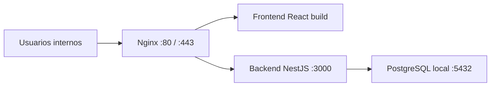

# Arquitectura de despliegue para servidor unico

## 1. Contexto

Servidor objetivo:

- host: `192.168.111.151`
- sistema operativo: `AlmaLinux 10.1`
- kernel: `6.12.0-55.9.1.el10_0.x86_64`
- CPU: `4 vCPU`
- RAM: `7.5 GiB`
- almacenamiento visible:
  - `/` -> `8G`
  - `/var` -> `8G`
  - `/opt` -> `8G`
  - `/app` -> `10G`

Restriccion principal:

- un solo servidor para frontend, backend y PostgreSQL

## 2. Objetivo de arquitectura

Desplegar el MVP del sistema RAT con una arquitectura simple, estable y operable en un solo host, evitando sobreingenieria y controlando especialmente:

- consumo de disco
- uso de memoria
- crecimiento de logs
- crecimiento de datos PostgreSQL

## 3. Arquitectura recomendada

## 3.1 Componentes

- `Nginx`
  - reverse proxy
  - servicio del frontend estatico
  - proxy hacia backend NestJS

- `Frontend React`
  - compilado a archivos estaticos
  - servido por Nginx

- `Backend NestJS`
  - proceso Node.js
  - ejecutado como servicio `systemd`

- `PostgreSQL`
  - instalado localmente
  - ejecutado como servicio del sistema
  - directorio de datos movido fuera de `/var`

## 3.2 Arquitectura logica



## 3.3 Decisiones clave

- no usar Kubernetes
- no dividir en microservicios
- no usar Docker para todo el stack en la primera version
- usar `systemd` para backend
- usar frontend estatico
- usar PostgreSQL instalado localmente

## 4. Distribucion recomendada en disco

## 4.1 Problema principal

`/var` solo tiene `8G`, y por defecto PostgreSQL y parte de los logs suelen crecer ahi. Eso es un riesgo.

## 4.2 Recomendacion

Usar `/app` como raiz operativa del sistema.

Estructura sugerida:

```text
/app/rat_dnsipd/
  backend/
  frontend/
  releases/
  shared/
    env/
    logs/
    uploads/
    temp/
  scripts/
  backups/
    postgres/
  postgresql/
    data/
```

## 4.3 Uso recomendado por ruta

- `/app/rat_dnsipd/backend`
  codigo backend desplegado

- `/app/rat_dnsipd/frontend`
  build estatico frontend

- `/app/rat_dnsipd/shared/env`
  archivos `.env`

- `/app/rat_dnsipd/shared/logs`
  logs controlados de aplicacion si hicieran falta

- `/app/rat_dnsipd/backups/postgres`
  backups comprimidos

- `/app/rat_dnsipd/postgresql/data`
  data directory de PostgreSQL

## 5. Puertos recomendados

- `80/tcp` -> Nginx HTTP
- `443/tcp` -> Nginx HTTPS
- `3000/tcp` -> backend NestJS, solo interno si es posible
- `5432/tcp` -> PostgreSQL, idealmente solo localhost o red restringida

## 5.1 Regla recomendada

- exponer publicamente solo `80` y `443`
- no exponer `3000`
- no exponer `5432` salvo necesidad administrativa controlada

## 6. Servicios del sistema recomendados

## 6.1 Nginx

Servicio:

- `nginx.service`

Responsabilidad:

- servir frontend
- manejar TLS
- enrutar `/api` hacia NestJS

## 6.2 Backend

Servicio:

- `rat-dnsipd-backend.service`

Responsabilidad:

- levantar backend NestJS
- reiniciar automaticamente ante falla

## 6.3 PostgreSQL

Servicio:

- `postgresql.service`

Responsabilidad:

- almacenamiento transaccional del sistema

## 7. PostgreSQL local

## 7.1 Recomendacion principal

PostgreSQL local es viable en este servidor, pero debe instalarse con configuracion conservadora.

## 7.2 Data directory

No recomiendo dejarlo en la ubicacion por defecto si eso implica depender de `/var`.

Recomendacion:

- mover `PGDATA` a `/app/rat_dnsipd/postgresql/data`

## 7.3 Parametros iniciales sugeridos

Estos valores son razonables como punto de partida para `7.5 GiB RAM`:

- `shared_buffers = 1GB`
- `effective_cache_size = 3GB`
- `work_mem = 8MB`
- `maintenance_work_mem = 256MB`
- `wal_buffers = 16MB`
- `max_connections = 80`
- `random_page_cost = 1.1`
- `effective_io_concurrency = 100`

Nota:

Estos no son definitivos, pero son una base prudente para un MVP sin analitica pesada.

## 7.4 Consideraciones funcionales

- activar `autovacuum`
- mantener indices controlados
- no guardar archivos grandes dentro de PostgreSQL
- evitar JSON masivo innecesario en auditoria

## 8. Backend NestJS

## 8.1 Modo de ejecucion

Recomendacion:

- compilar con `npm run build`
- ejecutar `node dist/main.js`
- gestionado por `systemd`

## 8.2 Memoria recomendada

Usar limite controlado de Node:

- `NODE_OPTIONS=--max-old-space-size=768`

Eso evita que el proceso crezca sin control.

## 8.3 Variables de entorno sugeridas

- `NODE_ENV=production`
- `PORT=3000`
- `DATABASE_URL=postgresql://...`
- `JWT_SECRET=<valor_fuerte>`
- `JWT_EXPIRES_IN=8h`

## 9. Frontend React

## 9.1 Despliegue recomendado

No ejecutar Vite en produccion.

Recomendacion:

- compilar frontend
- publicar solo el contenido de `dist/`
- servirlo con Nginx

## 9.2 Beneficio

- menor consumo de RAM
- menos procesos
- despliegue mas estable

## 10. Nginx

## 10.1 Responsabilidades

- servir SPA
- hacer proxy a `/api`
- aplicar cabeceras basicas de seguridad
- manejar HTTPS si hay certificado

## 10.2 Flujo recomendado

- `/` -> frontend estatico
- `/api` -> `http://127.0.0.1:3000`

## 11. Logs y rotacion

## 11.1 Riesgo

Con este servidor, los logs pueden llenar `/var` rapidamente si no se controlan.

## 11.2 Recomendacion

- usar `journald` para backend
- activar `logrotate` para Nginx
- mantener logs PostgreSQL con retencion prudente

## 11.3 Politica minima

- logs Nginx: rotacion diaria o por tamano
- logs backend: no duplicar en archivo si ya usa `journald`
- logs PostgreSQL: mantener trazabilidad, pero con rotacion y limpieza

## 12. Backups

## 12.1 Recomendacion minima obligatoria

Aunque el entorno sea pequeño, debes tener backup desde el dia 1.

## 12.2 Estrategia

- backup diario con `pg_dump`
- compresion `gzip`
- retencion local de `7` dias

Ruta recomendada:

- `/app/rat_dnsipd/backups/postgres`

## 12.3 Importante

El backup local no sustituye backup externo.

Si luego puedes habilitar otra maquina, NAS o repositorio seguro, hay que copiar ahi los dumps.

## 13. Seguridad base

## 13.1 Red

- abrir solo `80/443`
- cerrar `5432` al exterior
- cerrar `3000` al exterior

## 13.2 Aplicacion

- usuario de sistema dedicado para backend
- variables sensibles fuera del codigo
- secreto JWT robusto
- validacion de entrada activa
- CORS restringido al dominio real

## 13.3 Servidor

- actualizaciones del sistema
- SELinux revisado segun politica del entorno
- firewall con `firewalld`
- acceso SSH solo para administradores autorizados

## 14. Dimensionamiento esperado

## 14.1 Este servidor soporta

- MVP institucional
- concurrencia baja o media
- frontend + backend + PostgreSQL local
- operacion diaria con usuarios internos

## 14.2 Este servidor no deberia asumir todavia

- adjuntos pesados sin limite
- multiples ambientes completos en paralelo
- procesos batch intensivos
- BI pesado
- exportaciones masivas concurrentes

## 15. Estrategia de despliegue recomendada

## 15.1 Modelo simple

- una sola instancia backend
- un frontend build
- una sola base PostgreSQL

## 15.2 Estructura de releases

```text
/app/rat_dnsipd/releases/
  2026-04-24-001/
  2026-04-25-001/

/app/rat_dnsipd/current -> symlink al release activo
```

## 15.3 Beneficio

- rollback simple
- despliegues ordenados
- separacion entre artefacto y configuracion

## 16. Orden de implementacion recomendado en servidor

1. Preparar usuario tecnico y estructura de carpetas en `/app`
2. Instalar PostgreSQL
3. Mover `PGDATA` a `/app/rat_dnsipd/postgresql/data`
4. Instalar Node.js LTS
5. Instalar Nginx
6. Publicar backend
7. Publicar frontend
8. Crear servicio `systemd` del backend
9. Configurar Nginx reverse proxy
10. Configurar backups y rotacion
11. Configurar firewall
12. Probar acceso desde `192.168.111.151`

## 17. Esquema de acceso esperado

En entorno inicial de red interna:

- frontend: `http://192.168.111.151/`
- api: `http://192.168.111.151/api`

Si luego configuras DNS interno o certificado:

- `https://tu-dominio-interno/`
- `https://tu-dominio-interno/api`

## 18. Recomendacion final

La mejor arquitectura para este servidor es:

- frontend estatico con Nginx
- backend NestJS con `systemd`
- PostgreSQL local con data en `/app`
- logs con rotacion
- backups diarios
- puertos internos protegidos

No recomiendo complejizar mas el despliegue en esta fase.

## 19. Siguiente paso recomendado

El siguiente entregable mas util seria preparar:

1. estructura exacta de carpetas y usuarios del servidor
2. archivo `systemd` para backend
3. configuracion Nginx
4. plan de instalacion PostgreSQL y movimiento de `PGDATA`
5. checklist de despliegue paso a paso
